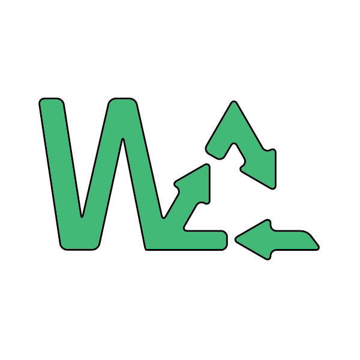

<!--
*** Thanks for checking out the Best-README-Template. If you have a suggestion
*** that would make this better, please fork the repo and create a pull request
*** or simply open an issue with the tag "enhancement".
*** Thanks again! Now go create something AMAZING! :D
***
***
***
*** To avoid retyping too much info. Do a search and replace for the following:
*** github_username, repo_name, twitter_handle, email, project_title, project_description
-->

<!-- PROJECT SHIELDS -->
<!--
*** I'm using markdown "reference style" links for readability.
*** Reference links are enclosed in brackets [ ] instead of parentheses ( ).

<!-- PROJECT LOGO -->
 

  

  

    
    
  

  <h3 align="center">WasteCreative</h3>
  <h6 align="center">Detection of household waste that has the potential to be a Creative Product</h6>

## About The Project

WasteCreative is an android application that can detect household waste objects and suggest crafts that can be made based on the detection results. We will also create a marketplace for buying and selling user-generated crafts. Besides being able to reduce the amount of household waste, this application also has the potential to help raise MSMEs in the creative industry welfare. This is the reason why we want to solve this problem.

### Installation

1. Clone the repository
2. Upload dataset_fix to google drive
3. Open the notebook for the model at [this](https://github.com/ahmadnurokhim/WasteCreative/blob/main/colab-notebooks/SSDMobileNetv2_64_final_v1.ipynb) link
4. Follow the instructions on the notebook and run the notebook until it's finished
5. The model will be converted to TFLite format and ready to use in the mobile application

<!-- USAGE EXAMPLES -->

## Dataset
For this project, we created our own dataset containing 17500 photos of household waste. The dataset can be accessed at [this](https://github.com/ahmadnurokhim/WasteCreative/tree/main/dataset_fix) link. The objects of this dataset are as follows:
  - plastic bottles
  - egg shell
  - plastic cups
  - can
  - plastic bags
  - cardboard box
  - sachet
  - plastic straws
  - plastic spoon
  - ice cream stick
  - skewers
  - bottle cap
  
## Other Project

You can also looking up our other repository in this project by this [**link**](https://github.com/Afrizal2609/WasteCreative).

<!-- ACKNOWLEDGEMENTS -->

## Acknowledgements

  </img>&nbsp; &nbsp;

